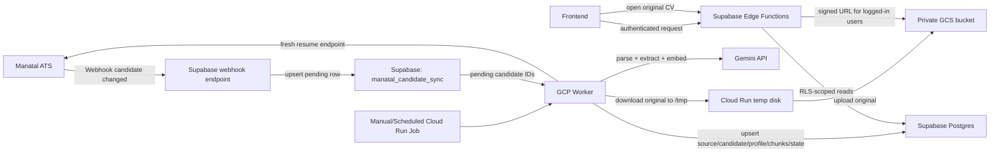
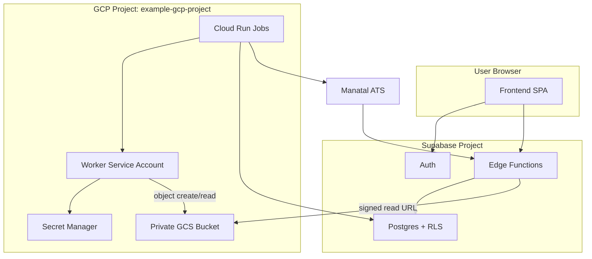
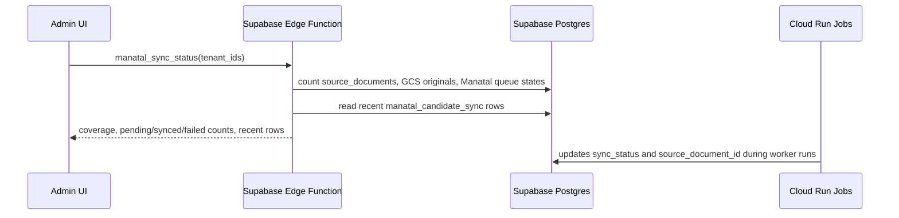

# GCP Manatal Sync HLD

## Context

The platform has two active data paths:

- Online read path for authenticated recruiters and admins.
- Offline worker path for Manatal ingestion, CV parsing, embeddings, and original CV storage.

Original CV files are now stored in a private GCS bucket, not Google Drive. The UI opens originals through an authenticated backend request that returns a short-lived protected URL.

## Main Players

| Player | Responsibility |
| --- | --- |
| Frontend | Recruiter/admin UI for search, dossier, parsing quality, and Manatal sync status. |
| Supabase Auth | Login, user identity, workspace/admin scope. |
| Supabase Edge Functions | Authenticated API facade for platform reads, protected CV URL generation, and admin sync status. |
| Supabase Postgres | Source documents, candidates, profiles, chunks, Manatal sync queue/state, shortlist, parser/admin data. |
| Manatal Webhook | Queues changed Manatal candidates into `manatal_candidate_sync`. |
| GCP Cloud Run Jobs | Runs deployed worker commands for pending sync and backfills. |
| Worker Image | Downloads Manatal resumes, parses CVs, writes DB rows, uploads originals to GCS. |
| GCS Bucket | Private storage for original CV files: `gs://example-cv-originals`. |
| Secret Manager | Supabase service role, Manatal token, Gemini key. |
| Gemini API | Structured CV extraction and embeddings. |

## Architecture

## Trust Boundaries

## Original CV Flow

1. Worker reads a pending Manatal candidate.
2. Worker calls Manatal `/candidates/{id}/resume/` to mint a fresh resume URL.
3. Worker downloads the original file to `/tmp`.
4. Worker uploads to `gs://example-cv-originals/{tenant_id}/{source_document_id}/{filename}`.
5. Worker updates `source_documents.storage_path` and `source_documents.source_uri` to the GCS object.
6. Edge Function `original_document_url` checks the logged-in user's access and returns a short-lived signed URL.
7. Frontend "Open original CV" opens only the protected URL.

## Sync Status Flow

## Admin Sync Status Page

Route: `/admin/manatal-sync`

The page is admin-only and shows:

- Protected original coverage: `source_documents.source_uri like 'gs://%'`.
- Drive-era originals remaining: `source_documents.source_uri ilike '%drive.google.com%'`.
- Manatal queue counts by `sync_status`: `pending`, `synced`, `failed`, `skipped`.
- Mapped Manatal rows: `manatal_candidate_sync.source_document_id is not null`.
- Last synced timestamp, last failure, and the latest queue updates.

The preferred backend path is the `manatal_sync_status` Edge Function action. During rollout, the frontend also has a direct Supabase fallback using the logged-in admin session, so the page can work before the Edge Function deployment is updated.

## Current Production Notes

- GCP project: `example-gcp-project`
- Region: `us-central1`
- GCS bucket: `example-cv-originals`
- Main pending sample job: `cv-worker-manatal-sync-sample`
- Backfill job: `cv-worker-manatal-originals-gcs`
- Normal worker service account: `cv-worker@example-gcp-project.iam.gserviceaccount.com`

## Operational Rules

- Keep GCS public access prevention enabled.
- Keep uniform bucket-level access enabled.
- Do not expose `gs://` or Manatal signed URLs directly to users.
- Use short-lived signed URLs from the backend for original CV access.
- Give the worker service account bucket object access only, not broad project owner/editor roles.
- Store Manatal, Supabase, Gemini, and GCS signing secrets in Secret Manager or Supabase secrets, not in frontend env.
- Run large Manatal jobs serially unless Manatal rate limits are understood.
- Keep old Drive URLs only as metadata/audit fallback, not as the primary open path.
